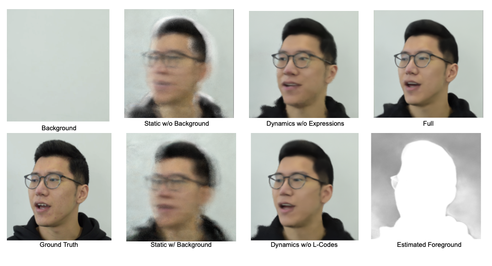
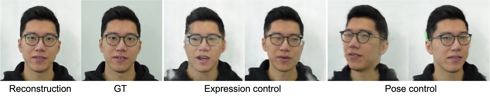

# NerFACE_pl
NerFACE re-implementation with pytorch lightning

## Checkpoint Download: 
  https://drive.google.com/file/d/1swmBt5XUnP6ciiq-RjninZWBtkr6lJuL/view?usp=sharing


### Dependency

torch version : 1.8.1+cu101

```
pip install pytorch-lightning
pip install hydra-core
pip install easydict
pip install lpips
```

### Run Codes-train

``` Running Examples
python train.py --config-name=nerface_fulldata.yaml gpu=[0]         # nerface 
```

### Run Codes-test
notebooks/test_nerface_extra.ipynb
### Experiment

Change ```configs/nerface_fulldata.yaml```.
own ur tastes e.g., basedir.


```data_size``` : Number of images for training the model.


``` Change experiment name
.yaml file
hydra:
  job:
    id: debug           # This one is experiment name
  run:
    dir: outputs/${now:%Y-%m-%d}/${now:%H-%M-%S}_${hydra.job.id}

Output format:
outputs/2021-09-08/13-16-40_debug
```

## Figures from our paper
### Figure 1.


### Figure 2.


### Figure 3.


### Figure 4.


### Figure 5.

